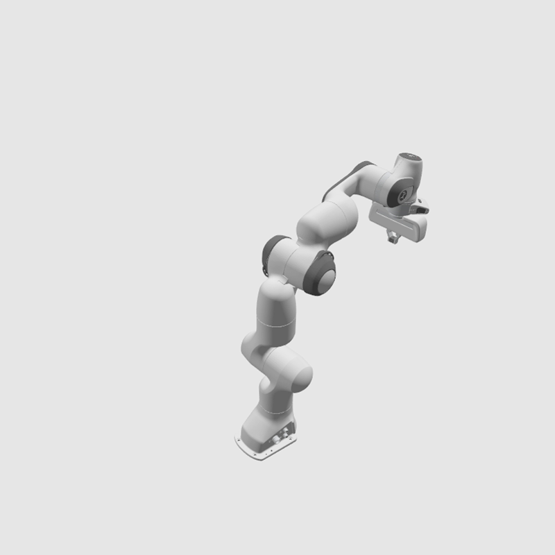

# panda_ign

URDF and SDF descriptions of Franka Emika Panda robot compatible with Ignition and MoveIt2.


**Collision geometry** was remodelled to make it more realistic and improve performance, see [#3](https://github.com/AndrejOrsula/panda_ign/pull/3).

**Inertial properties** of all links are estimated with [estimate_inertial_properties.py](scripts/estimate_inertial_properties.py) script, while assuming total mass of 18 kg and uniform density. This script also redistributes a potion of hand's mass to fingers due to internal mechanical coupling.

The SDF description also contains estimated **dynamic parameters** for joints. Note that these values are NOT based on real-life robot and should therefore be used with caution.

## Instructions

### ROS 2 (Optional)

Build with `colcon` and source the environment to make URDF discoverable for ROS 2.

### Ignition

Export `IGN_GAZEBO_RESOURCE_PATH` to make SDF discoverable within the context of Ignition Gazebo.

```bash
export IGN_GAZEBO_RESOURCE_PATH=${PARENT_DIR}/panda_ign:${IGN_GAZEBO_RESOURCE_PATH}
```

Alternatively, you can just include the model from [Ignition Fuel](https://app.ignitionrobotics.org/AndrejOrsula/fuel/models/panda) if you do not require the URDF description (or you use it from the official [franka_description](https://github.com/frankaemika/franka_ros)).

```xml
<include>
    <uri>https://fuel.ignitionrobotics.org/1.0/AndrejOrsula/models/panda</uri>
</include>
```

## Directory Structure

```bash
panda_ign
├── panda               # Model directory compatible with Ignition Fuel
    ├─ meshes           # Meshes for both SDF and URDF
        ├── collision   # STL files for collision detection
            └─ *.stl
        └── visual      # COLLADA files for visuals
            └─ *.dae
    ├─ thumbnails       # Thumbnails for Fuel
        └─ *.png
    ├── model.config    # Ignition model meta data
    └── model.sdf       # SDF description of the Ignition model
├── urdf
    └── panda.urdf      # URDF description of the model for MoveIt2
├── CMakeLists.txt
└── package.xml         # ROS2 panda description package `panda_ign`
```
